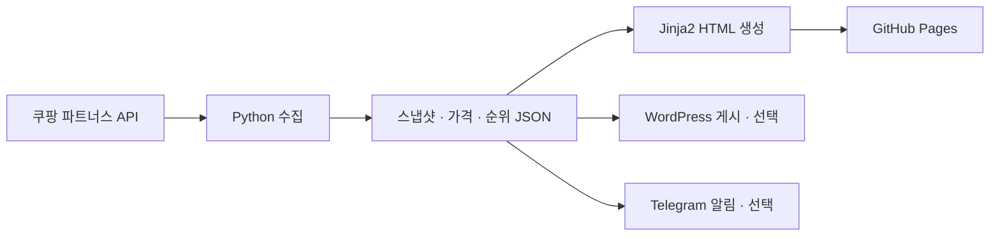

# 오늘딜 · Todaydeal

쿠팡 골드박스와 카테고리별 베스트 상품을 모으고, 직접 수집한 가격·순위 이력을 함께 보여주는 프로젝트입니다. Python으로 정적 사이트를 생성하며 WordPress 게시와 Telegram 알림도 선택적으로 연결할 수 있습니다.

[사이트 보기](https://hyac1107.github.io/todaydeal/) · [주방용품 베스트](https://hyac1107.github.io/todaydeal/c/kitchen.html) · [자동 실행 기록](https://github.com/HyaC1107/todaydeal/actions) · [원본 데이터](data/snapshots/)

## 주요 기능

- **골드박스**: API에서 받은 상품명·가격·이미지·구매 링크를 표시합니다.
- **카테고리 베스트 10**: 식품, 주방용품, 가전디지털, 생활용품, 뷰티, 스포츠레저, 반려동물용품을 수집합니다.
- **가격 변화**: 같은 상품·판매 옵션의 전일 대비 변화와 최근 30일 범위 내 관측 최저가 여부를 계산합니다.
- **순위 변화**: 카테고리별 순위 이력과 이전 관측 대비 변화를 표시합니다.
- **오늘의 3개**: 수집한 상품의 가격·순위 신호를 점수화해 소개할 상품을 고릅니다.
- **날짜별 기록**: 일일 스냅샷과 가격·순위 이력을 JSON으로 저장합니다.
- **선택 연동**: WordPress 글·카테고리 페이지 갱신, Telegram 아침·저녁 알림을 지원합니다.

매일 7개 카테고리를 모두 조회합니다. 요일별 대표 카테고리는 월 식품 → 화 주방 → 수 가전 → 목 생활 → 금 뷰티 → 토 스포츠 → 일 반려동물 순서입니다.

## 데이터 기준

| 항목 | 해석 기준 |
| --- | --- |
| 베스트 순위 | API가 반환한 **조회 시점의 카테고리 목록 순위**입니다. 실제 판매량 순위·리뷰 순위로 단정하지 않습니다. |
| 가격 | 스냅샷 수집 당시 가격입니다. 현재 가격, 배송비, 쿠폰 및 선택 옵션은 구매 페이지에서 확인합니다. |
| 최저가 표시 | 프로젝트가 관측한 데이터 범위 안에서의 비교입니다. 전체 시장 최저가나 30일 전체 시점의 최저가를 보장하지 않습니다. |
| 가격 비교 | 상품 ID에 더해 `vendorItemId`가 같은 이력만 비교합니다. 관측일 수가 부족하면 해석에 제한이 있습니다. |
| 리뷰·평점 | 현재 수집 데이터에는 리뷰 수, 리뷰 본문, 평점이 없습니다. 리뷰 확인은 별도 절차가 필요합니다. |
| 일부 수집 실패 | 오류를 기록하고, 사이트에서는 해당 카테고리의 최근 성공 자료와 수집 날짜를 표시합니다. |

직접 사용한 후기나 AI가 검증한 성능을 제공하는 서비스는 아닙니다. 순위 인용 시 날짜·카테고리·선택 옵션을 함께 확인하세요.

## 동작 흐름



인스타그램 자동화는 별도 프로젝트입니다. 이 저장소는 상품 선정에 참고할 순위 데이터를 제공하며, 인스타 게시·댓글·인포크 관리는 여기서 실행하지 않습니다.

## 로컬 실행

Python **3.11 이상**과 **uv**가 필요합니다. 명령은 저장소 루트에서 실행합니다.

```powershell
git clone https://github.com/HyaC1107/todaydeal.git
cd todaydeal
uv sync
Copy-Item .env.example .env
```

`.env`에 본인의 쿠팡 파트너스 API 키를 입력합니다. `.env`는 Git에서 제외됩니다.

```dotenv
COUPANG_ACCESS_KEY=발급받은_액세스_키
COUPANG_SECRET_KEY=발급받은_시크릿_키
```

새 데이터를 수집하고 사이트를 생성합니다. 실제 API 호출이 발생하고 `data/`가 갱신됩니다.

```powershell
uv run python scripts/daily.py
```

저장된 데이터로 사이트만 다시 만들려면 다음 명령을 사용합니다. API 키 없이 실행할 수 있습니다.

```powershell
$env:PYTHONPATH = "src"
uv run python -m coupang_deals.render
uv run python -m http.server 8000 --directory site
```

브라우저에서 `http://localhost:8000`을 엽니다. macOS/Linux에서는 렌더링 명령을 `PYTHONPATH=src uv run python -m coupang_deals.render`로 실행하면 됩니다.

API 연결만 확인하려면 `uv run python scripts/smoke.py`를 실행합니다. 골드박스 API를 1회 호출하며 키 값은 출력하지 않습니다.

## 주방용품 BEST 5 조회 예시

카테고리마다 최대 10개 상품이 저장됩니다. 다음 예시는 **주방용품 수집에 성공한 가장 최근 날짜**를 찾아 상위 5개를 출력합니다. 추가 API 호출은 없습니다.

```python
import json
from pathlib import Path

for path in sorted(Path("data/snapshots").glob("*.json"), reverse=True):
    snapshot = json.loads(path.read_text(encoding="utf-8"))
    products = snapshot.get("categories", {}).get("주방용품", [])
    if products:
        print("수집 시각:", snapshot["collected_at"])
        for product in sorted(products, key=lambda item: item["rank"])[:5]:
            print(f'{product["rank"]}위 | {product["name"]} | {product["price"]:,}원')
            print(product["url"])
        break
else:
    print("주방용품 수집 자료가 없습니다.")
```

공개 스냅샷 주소 형식은 다음과 같습니다. 해당 날짜의 파일이 실제로 있는지 먼저 확인하세요.

```text
https://raw.githubusercontent.com/HyaC1107/todaydeal/main/data/snapshots/YYYY-MM-DD.json
```

| 필드 | 내용 |
| --- | --- |
| `date`, `collected_at` | 기준 날짜와 한국 시간 기준 수집 시작 시각 |
| `category`, `best` | 요일별 대표 카테고리와 해당 목록 |
| `categories` | 카테고리 이름별 베스트 상품 배열 |
| `goldbox` | 골드박스 상품 배열 |
| `errors` | 수집에 실패한 항목과 오류 내용 |

상품에는 `id`, `vid`, `name`, `price`, `image`, `url`, `rank`, `category`, `rocket`, `free_shipping`이 저장됩니다. 카테고리 목록의 구분은 `categories`의 키를 기준으로 확인하세요.

## GitHub Actions

| 워크플로 | 예정 시간 · 한국 시간 | 작업 |
| --- | --- | --- |
| [daily](.github/workflows/daily.yml) | 매일 **09:17** | 수집 → 사이트 생성 → 선택 연동 → 데이터 커밋 → Pages 배포 |
| [evening](.github/workflows/evening.yml) | 매일 **20:13** | 골드박스 재조회 후 아침 대비 가격이 오르지 않은 후보의 Telegram 알림 |

GitHub 예약 실행은 지연될 수 있습니다. 두 워크플로 모두 Actions의 **Run workflow**로 수동 실행할 수 있습니다.

`daily`는 `main`에 대한 push에도 실행됩니다. `data/`만 변경한 커밋은 재실행하지 않습니다. 문서 수정으로 수집·외부 게시를 실행하고 싶지 않다면 커밋 메시지에 `[skip ci]`를 사용합니다.

현재 일일 수집은 골드박스 1회 + 카테고리 7회, 저녁에는 골드박스 1회를 추가 조회하는 구조입니다. 수동 실행과 코드 push에 의한 재실행은 별도입니다.

### 설정 변수

로컬은 `.env`, Actions는 **Settings → Secrets and variables → Actions**에서 설정합니다.

| 변수 | 용도 |
| --- | --- |
| `COUPANG_ACCESS_KEY`, `COUPANG_SECRET_KEY` | 상품 수집용 파트너스 API 인증 |
| `TELEGRAM_BOT_TOKEN`, `TELEGRAM_CHANNEL_ID` | Telegram 발송을 사용할 때 설정 |
| `SITE_URL` | Telegram의 사이트 안내 링크 |
| `WP_URL`, `WP_USER`, `WP_APP_PASSWORD` | 자체 호스팅 WordPress 게시 |
| `WPCOM_SITE`, `WPCOM_TOKEN` | WordPress.com 게시 클라이언트 인증 |
| `WPCOM_CLIENT_ID`, `WPCOM_CLIENT_SECRET` | `scripts/wpcom_auth.py`의 OAuth 설정 |

현재 `daily.yml`의 WordPress 단계는 `WP_URL` 설정 여부로 실행하며, 자체 호스팅 인증 변수만 전달합니다. WordPress.com을 Actions에 연결하려면 환경 변수와 실행 조건을 추가로 설정해야 합니다. `.env.example`의 `GEMINI_API_KEY`는 현재 기본 수집·렌더링에 필요하지 않습니다.

Pages 배포는 **Settings → Pages → Source**에서 **GitHub Actions**로 설정합니다.

## 선택 연동 명령

```powershell
# 최신 저장 자료를 WordPress에 실제 게시·갱신
uv run python scripts/post_wp.py

# 새로 수집한 뒤 WordPress 게시·갱신
uv run python scripts/post_wp.py --collect

# Telegram 아침 / 저녁 알림
uv run python scripts/notify_telegram.py am
uv run python scripts/notify_telegram.py pm
```

WordPress는 같은 slug의 글·페이지를 갱신해 중복 생성을 줄입니다. Telegram은 인증 정보가 설정되면 실제 발송하며, 토큰이 없으면 드라이런으로 메시지를 출력합니다. 저녁 실행은 골드박스 재조회가 포함되고, 조건에 맞는 후보가 없으면 발송하지 않습니다.

## 저장소 구조

```text
.github/workflows/       예약 수집·배포·알림
src/coupang_deals/
  coupang_api.py         파트너스 API 및 HMAC 인증
  collect.py             수집·스냅샷·가격 및 순위 이력 저장
  render.py              신호 계산 및 정적 HTML 생성
  render_wp.py           WordPress용 콘텐츠 생성
  wp_client.py           WordPress / WordPress.com 클라이언트
  telegram.py            아침·저녁 메시지 구성과 발송
scripts/                 실행 진입점과 연결 확인 도구
templates/               Jinja2 템플릿과 스타일
data/snapshots/          날짜별 상품 목록
data/prices.json         가격 이력
data/ranks.json          카테고리별 순위 이력
data/goldbox-evening/    저녁 실행 시 생성하는 재조회 자료
local-wp/                로컬 WordPress용 Docker Compose
site/                    생성된 정적 사이트 · Git 제외
```

가격·순위 이력은 수집 시 120일 범위로 정리합니다. 날짜별 스냅샷의 보관 방식과는 별개입니다.

## 제휴 안내

상품 구매 링크는 쿠팡 파트너스 링크를 포함합니다. 링크를 통한 구매에 따라 운영자에게 일정액의 수수료가 제공될 수 있습니다. 사이트·WordPress 콘텐츠·Telegram 메시지에는 제휴 고지 문구가 포함됩니다.

API 키, WordPress 인증 정보, Telegram 토큰은 공개 저장소에 커밋하지 않습니다. 결제 시점의 가격·옵션·배송 조건은 판매 페이지를 기준으로 확인하세요.
